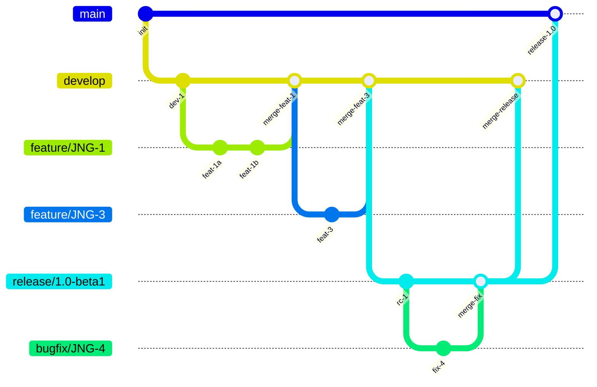
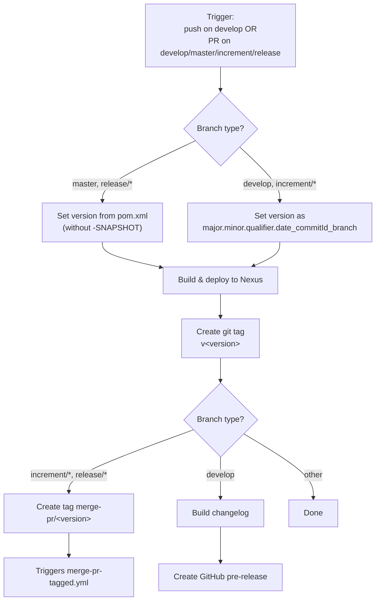
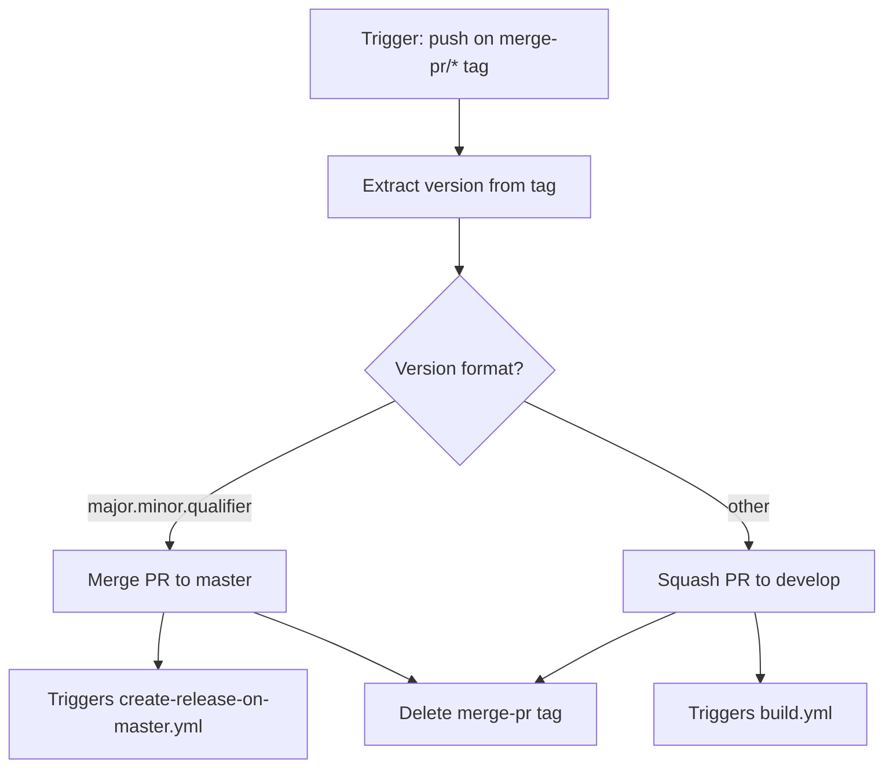
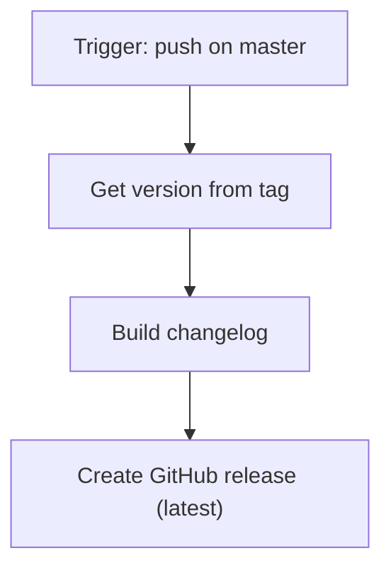
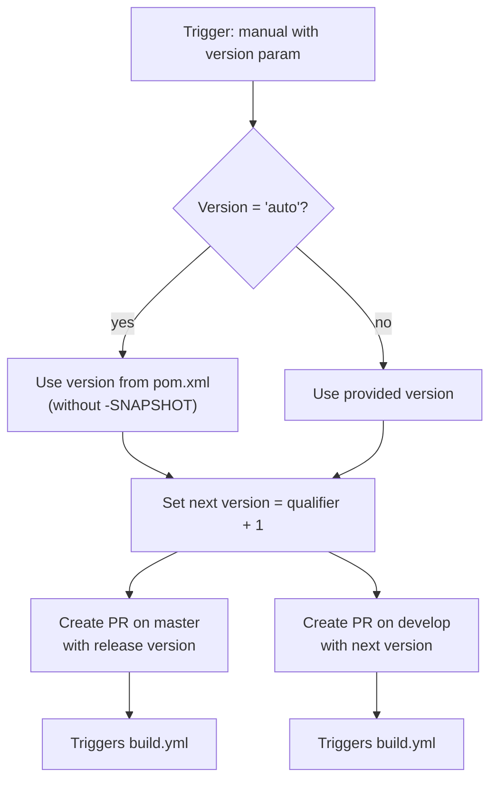
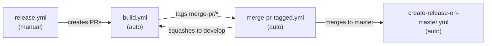

# Development Version and Branch Handling

This document describes the Git branching strategy, versioning policy, and CI/CD workflows for JUDO NG modules. The strategy is based on [GitFlow](https://www.atlassian.com/git/tutorials/comparing-workflows/gitflow-workflow).

## Branches

The repository uses five types of branches, each with a specific purpose in the development lifecycle:

| Branch Pattern | Base Branch | Purpose |
|----------------|-------------|---------|
| `develop` | — | Main development branch; contains the latest development sources of the current active version |
| `feature/JNG-NUMBER_short_summary` | `develop` | Feature branches for new work to be included in the next release |
| `(release/)X.Y.Z` | `develop` | Release branches for stabilization and testing before a final release (`release/` prefix is reserved for CI) |
| `bugfix/JNG-NUMBER_short_summary` | release branch | Bug fixes applied during release testing; must be propagated to newer release and development branches |
| `support/JNG-NUMBER_short_summary` | release branch | Minor changes for a previous release; merged back to the release branch when the update ships |
| `master` | — | Contains the latest released (stable) sources of the current active version |
| `hotfix/JNG-NUMBER_short_summary` | `master` | Urgent fixes applied to both release and master branches |

### Branch Flow

## Version Numbers

Version numbers follow **semantic versioning** with these rules:

| Event | Version Change |
|-------|---------------|
| Starting a `feature/` branch | No change — inherits from `develop` |
| Starting a `release/` branch | 2nd number on `develop` is incremented |
| `bugfix/` branch on a release | No change — fixes are applied before the release ships |
| Starting a `support/` branch | 3rd number is incremented (minor changes for a previous release) |
| Starting a `hotfix/` branch | 4th number is incremented (applied to both release and master) |

## GitHub Actions CI/CD Workflows

The project uses four interconnected GitHub Actions workflows that automate building, tagging, merging, and releasing.

### build.yml — Build & Deploy

This is the primary workflow, triggered on pushes to `develop` or pull requests targeting `develop`, `master`, `increment/*`, or `release/*`.

### merge-pr-tagged.yml — Auto-Merge Pull Requests

Triggered when a `merge-pr/*` tag is pushed. Decides whether to merge to `master` or squash to `develop` based on the version format.

### create-release-on-master.yml — Create Stable Release

Triggered on pushes to `master`. Builds a changelog and creates a GitHub release (marked as latest).

### release.yml — Manual Release Trigger

Manually triggered with a version parameter. Creates release pull requests for both `master` and `develop`.

### Workflow Interaction Overview

## Development Rules

> **Important:** There is no commit without a ticket number. Every pull request and commit must reference a JIRA ticket (`JNG-xxx`).

Issue tracking: [JIRA Dashboard](https://blackbelt.atlassian.net/jira/dashboards)
