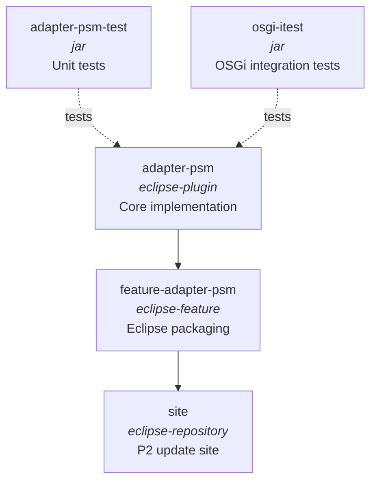
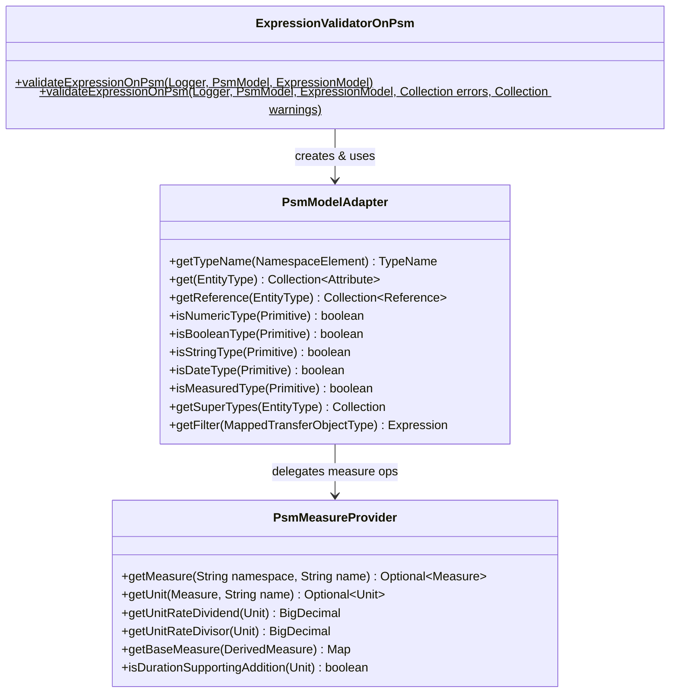
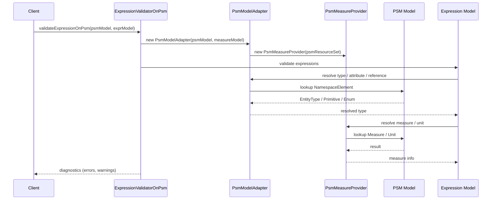
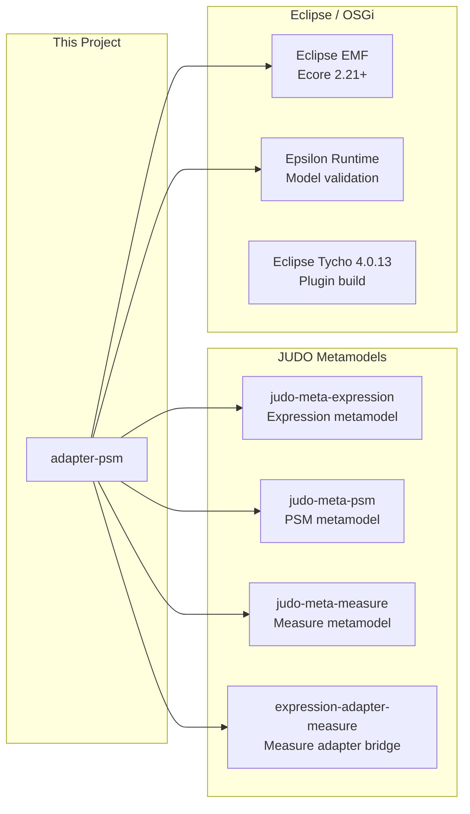

# Expression PSM Adapter

The **JUDO Expression PSM Adapter** bridges the JUDO Expression Language with PSM (Platform Specific Model) metamodels. It enables expression evaluation, type resolution, and validation against PSM-defined entity types, primitives, enumerations, measures, and transfer objects.

This module is part of the [JUDO framework](https://github.com/BlackBeltTechnology) by BlackBelt Technology.

## What It Does

1. **Type Resolution** — Resolves symbolic type names in expressions to actual PSM `EntityType`, `Primitive`, or `EnumerationType` definitions
2. **Attribute & Reference Navigation** — Validates and resolves attribute access and reference navigation expressions against the PSM schema
3. **Measurement Support** — Handles dimensional analysis, measure resolution, and unit conversions (e.g. length, mass, time, derived measures like velocity and density)
4. **Transfer Object Mapping** — Supports service/DTO layer mappings for `TransferAttribute` and `TransferObjectRelation`
5. **Expression Validation** — Validates complete expression models against PSM schemas, reporting errors and warnings

## Module Overview



| Module | Packaging | Description |
|--------|-----------|-------------|
| `adapter-psm` | eclipse-plugin | Core adapter: `PsmModelAdapter`, `PsmMeasureProvider`, `ExpressionValidatorOnPsm` |
| `adapter-psm-test` | jar | JUnit 5 unit and integration tests |
| `feature-adapter-psm` | eclipse-feature | Packages the plugin into an Eclipse feature for P2 distribution |
| `osgi-itest` | jar | OSGi integration tests running in a Karaf 4.4.7 container via Pax Exam |
| `site` | eclipse-repository | Builds the Eclipse P2 update site repository |

## Core Architecture

All production code resides in a single package: `hu.blackbelt.judo.meta.expression.adapters.psm`.



### Data Flow



### External Dependencies



## Build

Requires **JDK 21+** and **Maven 3.9.9+**. The project uses [SDKMAN!](https://sdkman.io/) for Java version management.

```bash
# Full build
mvn clean install

# Skip tests
mvn clean install -DskipTests

# Run only unit tests
mvn test -pl adapter-psm-test

# Run a single test class
mvn test -pl adapter-psm-test -Dtest=PsmModelAdapterTest

# Run OSGi integration tests (Karaf container)
mvn test -pl osgi-itest
```

> **Note:** Build success requires `[INFO] BUILD SUCCESS` with no `[ERROR]` lines in the output.

## License

[Eclipse Public License 2.0 (EPL-2.0)](LICENSE.txt)
