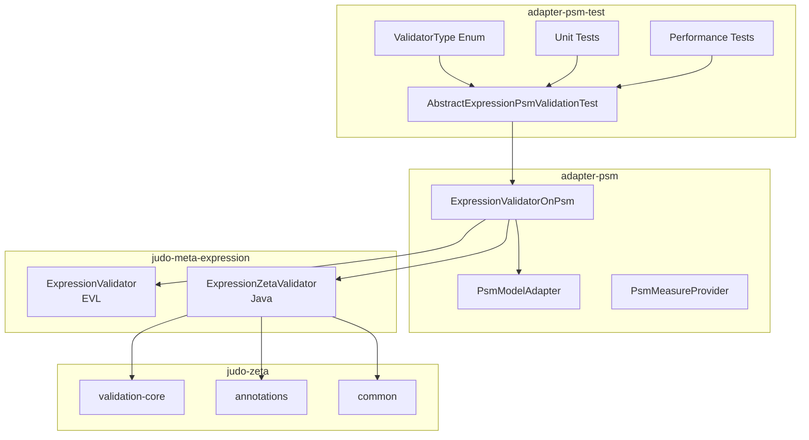

# Design: Zeta Dual Validation Integration

## Context
The judo-meta-expression project provides two parallel validation implementations:
- **EVL (Epsilon Validation Language)**: Model-driven validation using .evl scripts
- **Java/Zeta**: Native Java validation using annotations (@Constraint, @Critique, @Guard)

This adapter project needs to integrate both validation modes for PSM-based expression models, following the pattern established in judo-meta-esm.

## Goals / Non-Goals

### Goals
- Enable dual validation (EVL + Java) for expression models on PSM
- Provide parameterized test infrastructure for validation parity verification
- Add performance comparison tests with realistic model sizes
- Maintain OSGi compatibility with Zeta framework bundles
- Document validation architecture clearly

### Non-Goals
- Implement new validation rules (use judo-meta-expression validators only)
- Copy Zeta framework code (import as dependencies)
- Break existing EVL validation functionality
- Require users to choose validation mode (both run in tests)

## Decisions

### Decision 1: Validator Delegation Pattern
**What**: ExpressionValidatorOnPsm delegates to judo-meta-expression validators
**Why**: This project is an adapter, not a validator implementation

```java
public class ExpressionValidatorOnPsm {
    // EVL validation
    public static void validateExpressionOnPsm(...) {
        ExpressionValidator.validateExpression(log, expressionModel, adapter, ...);
    }

    // Java/Zeta validation
    public static void validateExpressionOnPsmWithZeta(...) {
        ExpressionZetaValidator.validateExpression(log, expressionModel, adapter, ...);
    }
}
```

### Decision 2: ValidatorType Enum for Parameterized Testing
**What**: Use enum-based parameterized tests like judo-meta-esm
**Why**: Ensures both validators are tested with identical test cases

```java
public enum ValidatorType {
    EVL,
    JAVA
}

@ParameterizedTest(name = "test [{0}]")
@EnumSource(ValidatorType.class)
void testValidation(ValidatorType type) { ... }
```

### Decision 3: Constraint Name Comparison Strategy
**What**: Extract constraint names from EVL exceptions for comparison with Java results
**Why**: EVL format differs from Java format but constraint names should match

- EVL format: `"ConstraintName|Full error message with context"`
- Java format: `"ConstraintName"`
- Comparison: Extract constraint name (before `|`) from EVL results

### Decision 4: Performance Test Model Generation
**What**: Generate test models programmatically with rackinspect-like characteristics
**Why**: Need realistic complexity for meaningful performance comparison

Model characteristics (based on rackinspect analysis):
| Element | Count | Details |
|---------|-------|---------|
| Entity Types | 70 | Business domain entities |
| Attributes/Entity | 14 | Mix of String, Boolean, Numeric, etc. |
| Relations/Entity | 6 | Aggregation and composition |
| Derived Members/Entity | 5 | Expressions for calculated fields |
| Total Elements | 10,000+ | Target for stress testing |

### Decision 5: Zeta Version Management
**What**: Use `${judo-zeta-version}` property with SNAPSHOT version
**Why**: Consistent version management across all Zeta dependencies

```xml
<properties>
    <judo-zeta-version>1.0.0-SNAPSHOT</judo-zeta-version>
</properties>
```

## Risks / Trade-offs

### Risk 1: Version Compatibility
**Risk**: Zeta SNAPSHOT may have breaking changes
**Mitigation**: Pin to specific SNAPSHOT timestamp version if needed

### Risk 2: Performance Overhead
**Risk**: Running both validators in tests doubles test time
**Mitigation**:
- Performance tests run separately with `@Tag("performance")`
- Parallel execution for Java validator
- Tests can be selectively disabled with Maven profiles

### Risk 3: OSGi Bundle Resolution
**Risk**: Zeta bundles may have dependency conflicts in Karaf
**Mitigation**: Follow judo-meta-esm pattern for bundle configuration

## Migration Plan

1. **Phase 1**: Add Maven dependencies and Zeta version property
2. **Phase 2**: Extend ExpressionValidatorOnPsm with Java validation
3. **Phase 3**: Create test infrastructure (ValidatorType, base class)
4. **Phase 4**: Migrate existing tests to parameterized format
5. **Phase 5**: Add performance tests
6. **Phase 6**: Update OSGi integration
7. **Phase 7**: Update documentation

No breaking changes - existing EVL validation continues to work.

## Open Questions
- None at this time. All design decisions follow established judo-meta-esm patterns.

## Architecture Diagram



## Reference Implementation
- **judo-meta-esm**: `/Users/robson/Project/judo-ng/models/judo-meta-esm`
  - `model-test/src/test/java/.../ValidatorType.java`
  - `model-test/src/test/java/.../AbstractEsmValidationTest.java`
  - `model/src/main/java/.../validation/EsmValidator.java`
